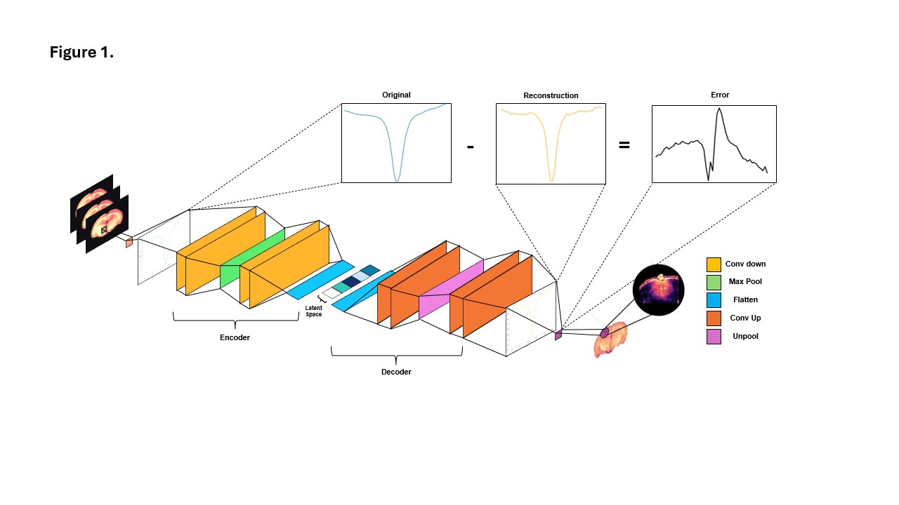

# GlioblastomaRatMultiOffset-UAD

**Unsupervised Anomaly Detection in a Glioblastoma Rat Model using CEST MRI**

This repository contains code and experiments for **unsupervised anomaly detection (UAD)** in chemical exchange saturation transfer (CEST) Z-spectra data acquired from a **glioblastoma (GBM) rat model**. The objective is to detect tumor-associated abnormalities **without requiring manually annotated labels during training** by learning the distribution of Z-spectra from healthy brain tissue and identifying deviations in glioblastoma pathology.

This work is motivated by challenges in computational healthcare research where labeled tumor masks are scarce and the heterogeneity of glioblastoma phenotypes makes delineation of tumor boundaries difficult by conventional imaging techniques. By leveraging machine learning models, including deep learning architectures, this project studies how **metabolic information from CEST improves tumor detection performance**.

---

## Overview

- **Task:** Unsupervised anomaly detection using Z-spectra from CEST MRI
- **Domain:** Pre-clinical MRI (glioblastoma rat model) 
- **Key idea:** Train models only on healthy brain data and flag deviations as anomalies  
- **Data:** Z-spectra (e.g., 8, 26, 52 offsets) from CEST MRI acquired at saturation power (B1) = 1.0µT and saturation duration = 3 seconds.




---

## Methods

The repository includes implementations and evaluation of:

- **Autoencoder-based models**
  - Convolutional Autoencoder (CAE)
  - Reconstruction-error–based anomaly scoring
- **Classical unsupervised baselines**
  - Isolation Forest
  - Local Outlier Factor (LOF)
- **Evaluation metrics**
  - ROC curves and AUC
  - Precision–Recall curves and AUC
  - Dice overlap with manual tumor masks
  - F1-score, accuracy, precision, recall
- **Offset ablation studies**
  - Performance comparison across reduced offset sets to assess robustness vs. accelerated acquisition (retrospective)

---

## Repository Structure

```text
GlioblastomaRatMultiOffset-UAD/
│
├── data/                  # Preprocessed MRI / Z-spectra data
├── notebooks/             # Analysis and visualization notebooks
├── utils/                 # Metrics, plotting, helper functions
├── requirements.txt
└── README.md
```
## Requirements

- Python ≥ 3.8  
- PyTorch ≥ 1.10  
- NumPy  
- SciPy  
- scikit-learn  
- Matplotlib / Seaborn  
- nibabel (for MRI data handling)

Install dependencies with:

```bash
pip install -r requirements.txt
## Requirements
```
