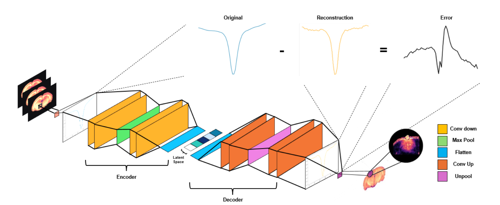

# GlioblastomaRatMultiOffset-UAD

**Unsupervised Anomaly Detection for Multi-Offset MRI in a Glioblastoma Rat Model**

This repository contains code and experiments for **unsupervised anomaly detection (UAD)** in multi-offset MRI data acquired from a **glioblastoma (GBM) rat model**. The objective is to detect tumor-associated abnormalities **without requiring lesion labels during training**, by learning the distribution of healthy brain tissue and identifying deviations (reconstruction error).

This work is motivated by challenges in computational healthcare research where labeled tumor masks are scarce and signal characteristics vary across frequency offsets. By leveraging reconstruction-based and distance-based unsupervised models, this project studies how **multi-offset information improves tumor detection performance**.

---

## Overview

- **Task:** Unsupervised voxel-wise anomaly detection  
- **Domain:** Pre-clinical MRI (glioblastoma rat model)  
- **Key idea:** Train models only on healthy brain data and flag deviations as anomalies  
- **Data:** Multi-offset MRI / Z-spectra (e.g., 8, 26, 52 offsets)




---

## Methods

The repository includes implementations and evaluation of:

- **Autoencoder-based models**
  - Convolutional Autoencoders (CAE)
  - Reconstruction-error–based anomaly scoring
- **Classical unsupervised baselines**
  - Isolation Forest
  - Local Outlier Factor (LOF)
  - PCA-based anomaly detection
- **Evaluation metrics**
  - ROC curves and AUC
  - Precision–Recall curves
  - Dice overlap with manual tumor masks
- **Offset ablation studies**
  - Performance comparison across reduced offset sets to assess robustness vs. acquisition cost

---

## Repository Structure

```text
GlioblastomaRatMultiOffset-UAD/
│
├── data/                  # Preprocessed MRI / Z-spectra data
├── notebooks/             # Analysis and visualization notebooks
├── utils/                 # Metrics, plotting, helper functions
├── requirements.txt
└── README.md
```
## Requirements

- Python ≥ 3.8  
- PyTorch ≥ 1.10  
- NumPy  
- SciPy  
- scikit-learn  
- Matplotlib / Seaborn  
- nibabel (for MRI data handling)

Install dependencies with:

```bash
pip install -r requirements.txt
## Requirements
```
